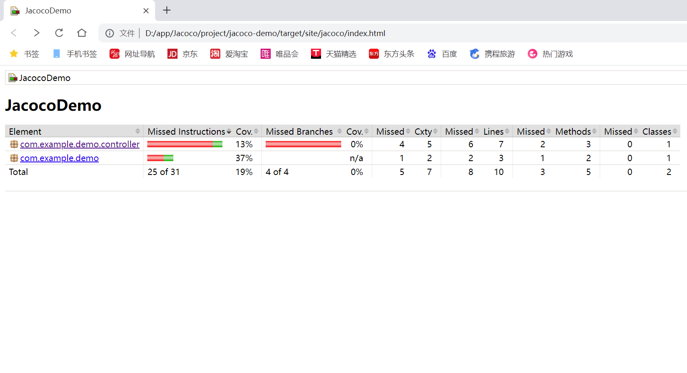

# Jacoco 代码覆盖率完整学习笔记
## 一、Jacoco 是什么
Jacoco 是 Java 代码覆盖率统计工具，可统计：指令覆盖率、行覆盖率、方法覆盖率、分支覆盖率，用于检测单元测试/手工功能测试是否覆盖完整业务代码，提前发现漏测逻辑。

## 二、环境准备
### 1. JDK
JDK 1.8 及以上，已配置系统环境变量，`java -version` 可正常执行。

### 2. Maven 安装与配置（核心依赖管理工具）
#### （1）下载
官网下载二进制包：`apache-maven-3.9.16-bin.tar.gz`

#### （2）解压路径
`D:\app\apache-maven\apache-maven-3.9.16-bin\apache-maven-3.9.16`

#### （3）系统环境变量配置
1. 系统变量新建：
变量名：`MAVEN_HOME`
变量值：`D:\app\apache-maven\apache-maven-3.9.16-bin\apache-maven-3.9.16`
2. Path 新增：`%MAVEN_HOME%\bin`
3. 关闭所有CMD，新开终端验证：
```shell
mvn -v
```

出现版本信息即配置成功。

#### （4）国内下载提速：配置阿里云镜像
打开 `maven/conf/settings.xml`，在 `<mirrors>` 内添加：
```xml
<mirror>
    <id>aliyunmaven</id>
    <mirrorOf>*</mirrorOf>
    <name>阿里云公共仓库</name>
    <url>https://maven.aliyun.com/repository/public</url>
</mirror>
```

### 3. Jacoco 工具包
解压路径：`D:\app\Jacoco\jacoco-0.8.8`
核心文件：
- `jacocoagent.jar`：运行程序时采集覆盖率
- `jacococli.jar`：命令行工具（生成报告、远程TCP抓取）

## 三、Demo 测试项目
### 1. 项目地址
`D:\app\Jacoco\project\jacoco-demo`
SpringBoot 2.2.2 测试项目，用于练习Jacoco。

### 2. pom.xml 完整 Jacoco 插件配置
必须添加插件才会自动生成 `target/site/jacoco` 网页报告：
```xml
<properties>
    <java.version>1.8</java.version>
    <jacoco.version>0.8.8</jacoco.version>
</properties>

<build>
    <plugins>
        <plugin>
            <groupId>org.springframework.boot</groupId>
            <artifactId>spring-boot-maven-plugin</artifactId>
        </plugin>

        <!-- Jacoco覆盖率插件 -->
        <plugin>
            <groupId>org.jacoco</groupId>
            <artifactId>jacoco-maven-plugin</artifactId>
            <version>${jacoco.version}</version>
            <executions>
                <!-- 1. 测试时自动插桩采集数据 -->
                <execution>
                    <id>prepare-jacoco-agent</id>
                    <goals>
                        <goal>prepare-agent</goal>
                    </goals>
                </execution>
                <!-- 2. 测试完成自动生成HTML报告 -->
                <execution>
                    <id>generate-jacoco-report</id>
                    <phase>test</phase>
                    <goals>
                        <goal>report</goal>
                    </goals>
                </execution>
                <!-- 可选：覆盖率阈值校验，不达标构建失败 -->
                <execution>
                    <id>check-coverage</id>
                    <phase>verify</phase>
                    <goals>
                        <goal>check</goal>
                    </goals>
                    <configuration>
                        <rules>
                            <rule>
                                <limits>
                                    <limit counter="LINE" minimum="0.7"/>
                                    <limit counter="BRANCH" minimum="0.6"/>
                                </limits>
                            </rule>
                        </rules>
                    </configuration>
                </execution>
            </executions>
        </plugin>
    </plugins>
</build>
```

## 四、方式一：Maven 单元测试自动生成覆盖率（最常用）
### 1. 执行命令
```shell
# 清空旧缓存 + 执行测试 + 自动生成jacoco报告
mvn clean test
```

### 2. 报告路径
```
项目目录/target/site/jacoco/index.html
```

### 3. 报告指标详解
| 指标 | 含义 |
|------|------|
| Instructions Cov. | 字节码指令覆盖率（最细粒度） |
| Branches Cov. | 分支覆盖率（if/else、判断逻辑，0%代表无分支覆盖） |
| Lines | 代码行覆盖率 |
| Methods | 方法覆盖率 |
| Classes | 类覆盖率 |

颜色标识：
- 绿色：代码已被测试执行
- 红色：代码完全未执行（漏测）
- 黄色菱形：if分支只覆盖其中一条

## 五、常见报错与解决方案
### 1. 'mvn' 不是内部或外部命令
原因：Maven环境变量路径配置错误、未关闭旧CMD窗口
解决：核对MAVEN_HOME路径，全部关闭终端重新打开，执行 `mvn -v` 验证。

### 2. target文件夹找不到site目录
原因：pom.xml缺少jacoco的report执行节点，未配置完整插件
解决：复制完整插件配置到pom，执行 `mvn clean test` 重新生成。

### 3. Unable to access jarfile xxx.jar
原因：未执行 `mvn package` 打包，target下无jar包；启动命令缺少 `-jar` 参数
解决：先打包，启动命令补充 `-jar`。

### 4. 分支覆盖率0%
原因：Controller接口无单元测试，if/else两条分支均未被代码调用
解决：编写MockMvc单元测试，分别传入参数覆盖if、else分支。


